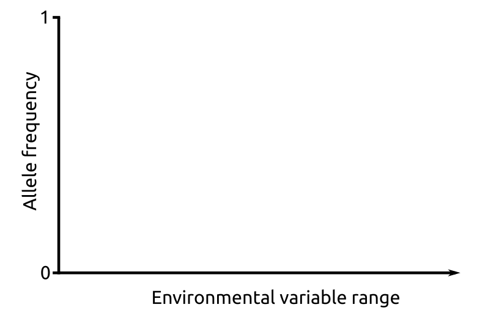
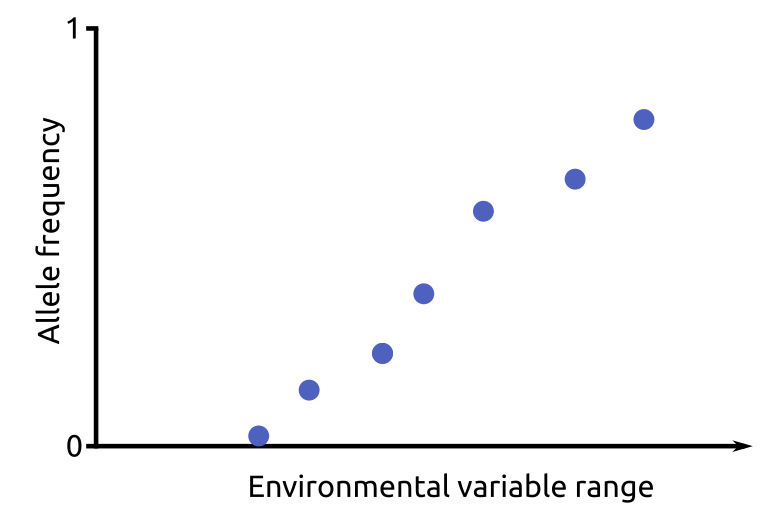
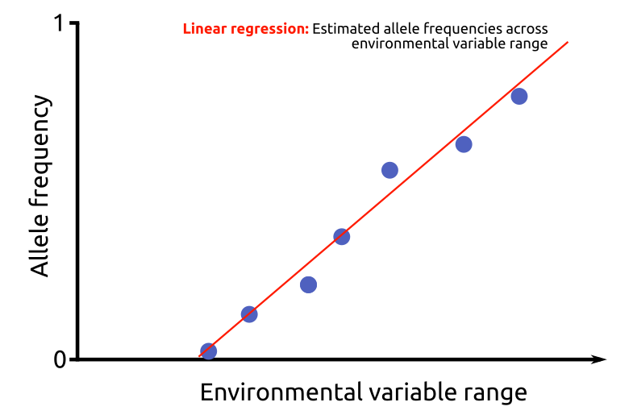
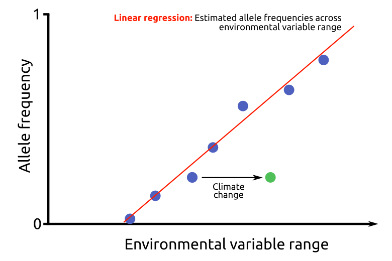
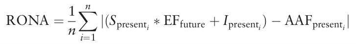
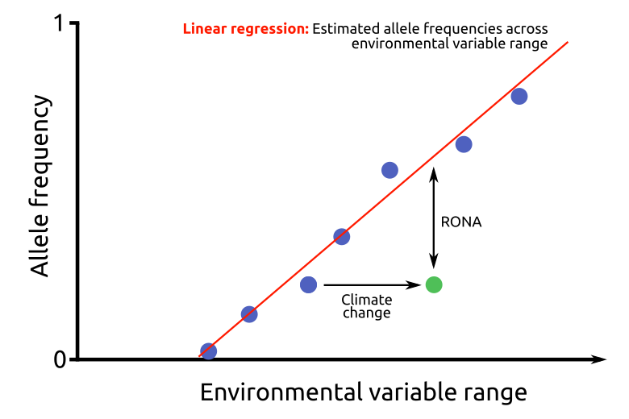

# Method description

This section describes how the *Risk of non-adaptedness* (RONA) method works, and how it was implemented in *pyRona*.

## Requirements

The RONA method requires a matrix of set grouped individuals characterized for three different components:

* Genetic information (in this case, allele frequencies across a set of loci)
* Current environmental data
* Future predictions of the provided environmental variables

## In a nutshell

After establishing marker-environmental associations, based on **present allele frequencies and present environmental variables**, the inferred linear model is used to estimate **future expected** allele frequencies.
The **average difference** between **current** and **future expected** allele frequencies can be viewed as the required average change in allele frequency for the species to adapt to future local conditions. This value is called the "RONA value".

## Original description

The original RONA method is described in [Rellstab et al. 2016](doi.wiley.com/10.1111/mec.13889). Here is a brief recap of the main points from the original research paper. For a more detailed understanding it is recommended that you actually read the research paper.

In [Rellstab et al. 2016](doi.wiley.com/10.1111/mec.13889), the software *LFMM* [Frichot et al. 2013](doi:10.1093/molbev/mst063)  is used to calculate environmental associations between environmental factors and allele frequencies. In order to reduce the amount of false positives, any associations with a *Spearman's rank coefficient* below 0.3 are removed.

Present and future environmental factors values are then compared using paired *t*-tests and ranked according to the resulting *p*-values. Only the **three** most differentiated factors are further analysed.

To estimate the adaptedness of populations to future local conditions, the extent to which the present allele frequencies at climate-related SNPs differ in average from those expected under modelled future climate, given the respective linear model of environmental association is assessed. This required average change in allele frequency is defined as the risk of nonadaptedness (RONA) to future conditions.

To infer RONA, first, simple linear regressions of the selected environmental factors of the present climate (EFpresent) with the alternative allele frequencies (compared to the reference sequence, AAFpresent) for all loci are performed.

Per environmental factor tested, the top 20 loci from significant (P < 0.05) linear regressions that are also candidate loci in the LFMM analysis are selected. To exclude linked loci, only one locus per target is included.

The regression coefficients (Spresent=slope, Ipresent=intercept) of these relevant loci are then used to predict AAFfuture, the allele frequency of the population that matches the regression at values of the future climate scenario for the given location (EFfuture).

The average absolute difference between AAFpresent and AAFfuture represents the RONA of a population to future conditions, or, in other words, the average change in allele frequency at the *n* relevant loci that is needed to be adapted to altered conditions. This results in the following formula:

