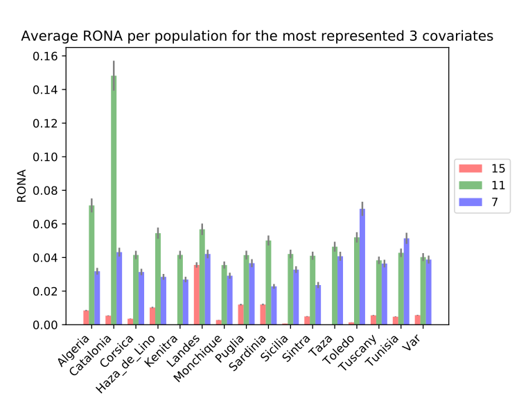

# Output

## **Under construction**

*pyRona* outputs a summary of the calculated RONA values as a table (tab separated) into STDOUT.

```
Covar	15	11	7
#SNPs	79	51	33
Algeria	0.0084844044934	0.071010652621	0.0318355554296
Catalonia	0.00538080542496	0.148224290544	0.0432074767179
Corsica	0.00357238083933	0.0415184015008	0.0313839088155
Haza_de_Lino	0.0102554219473	0.0544943509366	0.0284981095057
Kenitra	0.0	0.0415741469306	0.0268932992612
Landes	0.035571216301	0.0568096084797	0.04211703052
Monchique	0.00278030644016	0.0355090488922	0.0291713076108
Puglia	0.0119804016111	0.0414517165647	0.0366393055113
Sardinia	0.0120567853327	0.0501467882437	0.0228297189998
Sicilia	0.000701717664867	0.0421158962614	0.0327999241219
Sintra	0.00494089719003	0.04106586608	0.0236073001937
Taza	0.0	0.0464461743389	0.0407614840883
Toledo	0.00140343532973	0.0520166658985	0.0689959616092
Tuscany	0.00558737947653	0.0383453031679	0.0364052552458
Tunisia	0.0047737652135	0.0428205750754	0.0514393782797
Var	0.00567753383393	0.0402534572503	0.0387796960398
Min R^2	1.56323069265e-08	6.00663354845e-06	0.000669393794531
Max R^2	0.340966249445	0.295630728315	0.331642046678
Average R^2	0.159749823543	0.146583729785	0.154453256822
```

By default, this table contains the RONA values for the three most frequent associations, but this can be changed in the program options.
Additionally, these values are also plotted as a PDF as in the example below:



Furthermore, *pyRona* can also output the individual plot for each marker and environmental variable, as in the example below:

 
